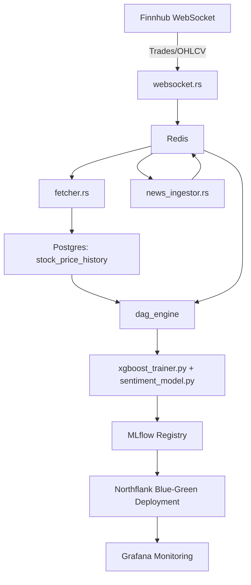

# **TRIGGERSTOCK**

A high-performance, real-time crypto analytics and prediction platform.  
Built in **Rust** with full **data pipelines, multimodal ML, and MLOps** for intraday tick prediction.

---

## 🚀 Overview

- ⚡ **Rust async pipelines** (Tokio + Redis + Postgres) for low-latency ingestion  
- 🌐 **Finnhub WebSocket** streaming ~160k+ rows/day at **<10ms latency**  
- 🗄 **Redis → Postgres bridge** for persistence of OHLCV & trades  
- 🧮 **DAG-based feature engine** (10+ TA indicators) generating >100k training samples  
- 📰 **Transformer-based sentiment analysis** from Coindesk RSS, symbol-mapped  
- 🤖 **Multimodal signal fusion** (price + volume + sentiment) via XGBoost + Transformers  
- 📊 **Grafana dashboards** for real-time monitoring (latency, throughput, accuracy)  
- ☁️ **Northflank Blue-Green deployments** with MLflow for experiment tracking & 99.9% uptime  

---

## 🧠 What It Does

| Component                 | Description                                                                 |
| ------------------------- | --------------------------------------------------------------------------- |
| ✅ `ws_ingestor.rs`        | Connects to Finnhub WebSocket and streams live prices into Redis (<10ms)   |
| ✅ `fetcher.rs`            | Periodically writes OHLCV from Redis into Postgres with TLS/NoTLS fallback |
| ✅ `news_ingestor.rs`      | Collects Coindesk RSS, maps to symbols, stores JSON headlines in Redis      |
| ✅ `dag_engine.rs`         | Computes 10+ TA indicators (RSI, MACD, VWAP, etc.) for training datasets   |
| ✅ `xgboost_trainer.py`    | Trains tick prediction classifier, logged via MLflow                       |
| ✅ `sentiment_model.py`    | Transformer-based sentiment scorer for financial news                      |
| 🧪 `deployment/`           | Blue-Green deployment scripts with MLflow model registry + Northflank CI   |

---

## 🏗 Architecture

---

## ⚙️ Tech Stack

- 🦀 Rust (Tokio, async, Redis, Postgres)  
- 🐍 Python (XGBoost, Transformers, MLflow)  
- 🗄 Redis + PostgreSQL (real-time + persistence)  
- 📊 Grafana (real-time monitoring & dashboards)  
- ☁️ Northflank (Blue-Green deployment, CI/CD, 99.9% uptime)  

---

## 📈 Model Training

- **XGBoost tick classifier** with DAG-engine features  
- **Transformer sentiment fusion** for news-driven volatility  
- Metrics tracked via MLflow: accuracy, F1, false-signal reduction (~18%)  
- Continuous retraining + deployment with zero downtime  

---

## 🤝 Contributing

PRs are welcome!  
If you're interested in **real-time systems**, **crypto modeling**, or **ML infra**, open an issue or contribute directly.

---

## 📜 License

MIT © 2025 Swastik Nandy
